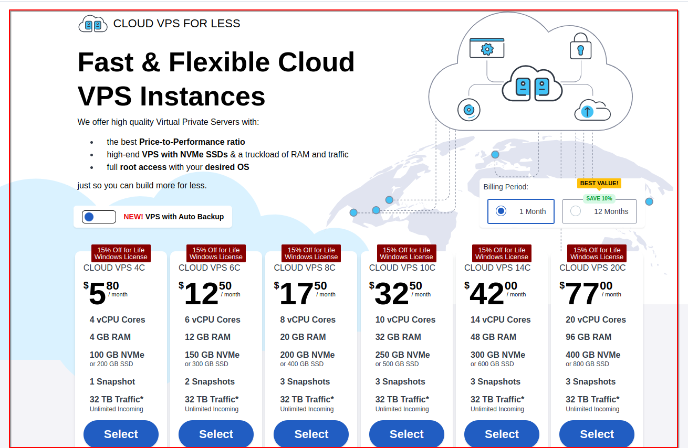
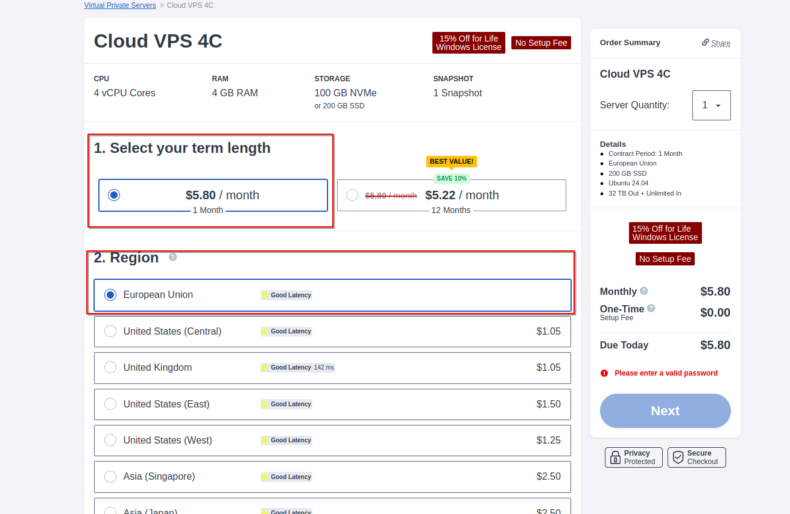
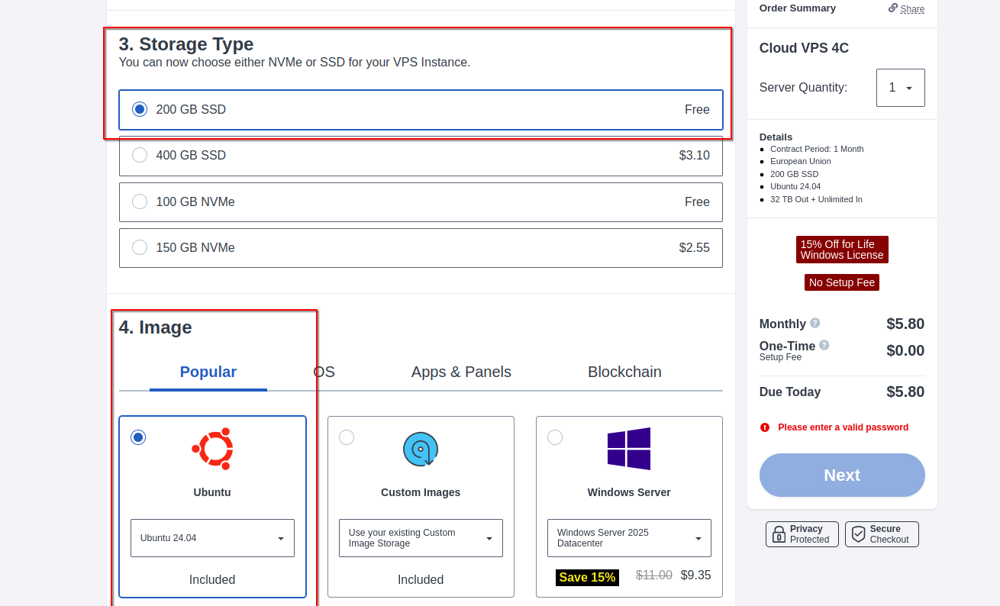
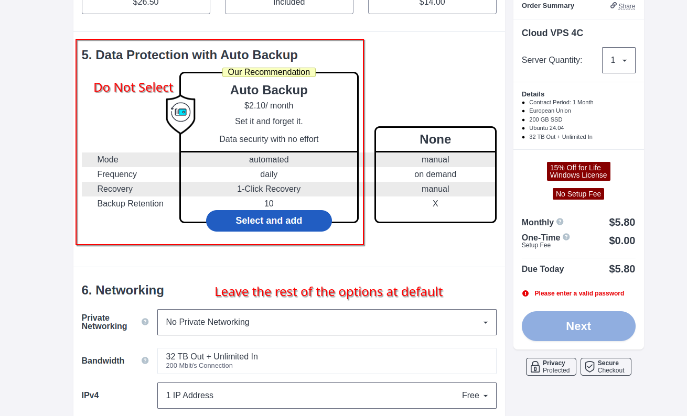
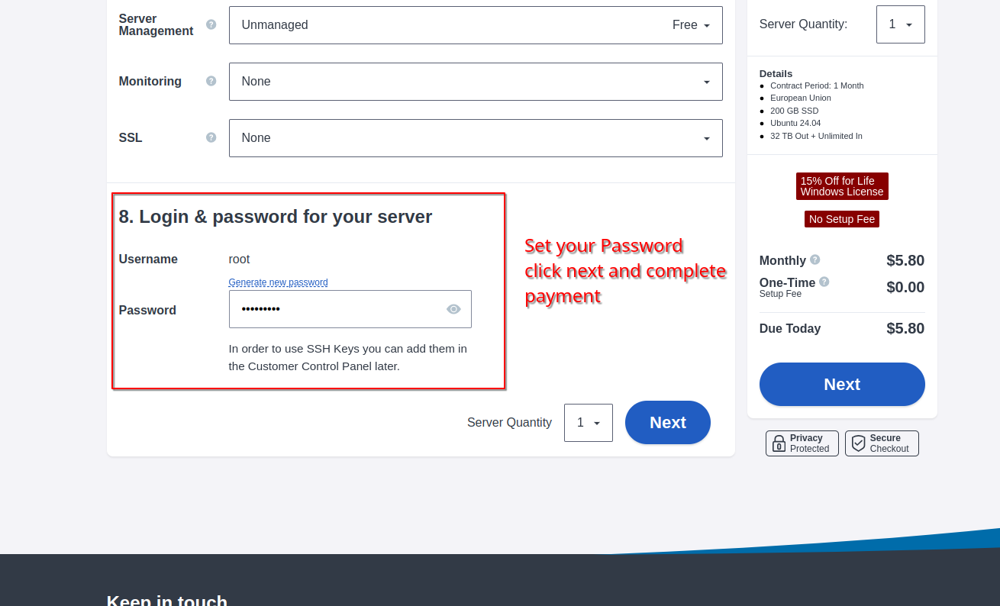

# Setting-Up-VPS
# 🌐 How to Purchase and Set Up a VPS from Contabo

This guide will walk you through purchasing a VPS from Contabo and setting it up for running a crypto node. You can also follow along with the images provided.
If you have other VPS provider in mind or You've already Bought, You can proceed on how to set up your vps
---

## 🎯 Steps to Purchase a VPS from Contabo

### 1️⃣ **Visit the Contabo Website**  
Go to the [Contabo VPS page](https://contabo.com/en/vps/).



### 2️⃣ **Choose a VPS Plan**  
Contabo offers various VPS plans. Depending on your needs, choose one of the following:
- **VPS S** – Budget-friendly for small tasks
- **VPS M** – Ideal for moderate use
- **VPS L** – Best for high-performance use cases (e.g., running a crypto node)

For crypto nodes, the **VPS S** or **VPS M** is recommended.


### 3️⃣ **Select Data Center Location**  
Choose the data center location closest to your target audience or network. Contabo offers options like **Germany** and **USA**.



### 4️⃣ **Customize Your VPS**  
After selecting your plan, you can customize:
- **Operating System**: Choose between Ubuntu, Debian, CentOS, etc.
- **Additional Features**: Optional upgrades such as extra storage, additional IPs, or backups (Advice, leave those at default).





### 5️⃣ **Proceed to Checkout**  
Click on the **Order** button after customizing your VPS.


### 6️⃣ **Create an Account / Log In**  
Create a Contabo account or log in if you already have one.


### 7️⃣ **Enter Billing Information**  
Provide your billing information, including payment details. Contabo supports **Credit Card**, **PayPal**, and **Bank Transfer**.

### 8️⃣ **Complete Your Purchase**  
Review your order and complete the payment process. You’ll receive an email with your VPS login details after payment.

---

# 💻 How to Set Up Your VPS for Running a Crypto Node

Once your VPS is ready, follow these steps to set it up for running a crypto node.


***


## 1. Connect to Your VPS  

Once you have your VPS credentials (IP address and root password), connect using SSH:  

```
ssh root@your_server_ip
```

For example, if your VPS IP is 192.168.1.100, you would run:
```
ssh root@192.168.1.100
```
## 2. Update and Upgrade the System
Updating the package list and upgrading installed packages ensures your system is secure and up to date.

```sh
apt update && apt upgrade -y 
```
### Example Output:

```
Reading package lists... Done
Building dependency tree       
Reading state information... Done
The following packages will be upgraded:
  openssl, curl, ssh
...

```

## 3. Create a New User
It's not safe to use the root account for daily tasks. Create a new user with a custom name.

```
adduser newuser

```
Replace newuser with your desired username.

### Example Output:
```
adduser tony
```

Now, give this user sudo privileges:

```
usermod -aG sudo newuser  # For replace newuser with your username above
```
## 4. Log in as the New User
Once you've created your new user (tony in this example, also remember the password you used in creating the new user in case of Next time Log in), switch to the user using SSH

```
ssh tony@your_server_ip #Check your mail/ log into your contabo account to get your server IP address

```

If you're already logged into the VPS as root, switch to the new user:

```
su - newuser

```
- That's all that's needed for basic vps setup for running Crypto Node.

- Once logged In as a User

- Get the necessary command from the project you're running node for, paste the code and follow their installation guide

Cheers, you're now running your own node.

